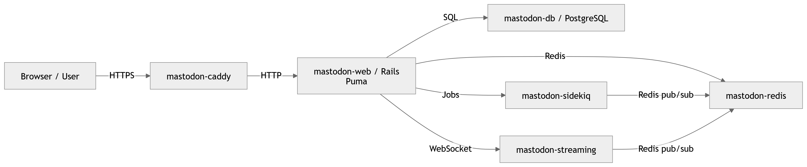

# Mastodon Local Development Guide

This guide explains how to set up Mastodon locally using Docker, HTTPS via mkcert, and Caddy, including common debugging steps.

---

## 1. Prerequisites

### Docker

- **Linux**: Install Docker Engine from your distro package manager. There is also a Docker Desktop for Linux.
- **Windows**: Install [Docker Desktop](https://docs.docker.com/desktop/setup/install/windows-install/).

**Docker Desktop Key Details:**

- OS: Windows 10/11 64-bit (22H2 or higher)  
- CPU: 64-bit with SLAT  
- RAM: 4GB+ recommended  
- Virtualization: Enabled in BIOS/UEFI  
- Backend: WSL2 recommended for best performance

---

## 2. Clone the repository

```bash
git clone <https://github.com/carlosdgerez/mastodon-test.git>
cd <repo-directory>
```


---

## 3. Start Docker containers

```bash
docker compose -f docker-compose-local.yml up -d
```

- First run will pull all images and start the containers.  
- Check container status:

```bash
docker compose ps
```

---

## 4. Handling HTTPS locally

### Step 1 — Install mkcert

- Windows (PowerShell):

```powershell
choco install mkcert
```

- Or download from: [https://github.com/FiloSottile/mkcert](https://github.com/FiloSottile/mkcert)

### Step 2 — Generate local CA and certificates

```bash
mkcert -install
mkcert localhost 127.0.0.1
```

This creates:
- `localhost+1.pem` → certificate  
- `localhost+1-key.pem` → private key

### Step 3 — Configure Caddy

**docker-compose-local.yml:**

```yaml
caddy:
  image: caddy:2
  restart: always
  ports:
    - "443:443"
  volumes:
    - ./Caddyfile:/etc/caddy/Caddyfile
    - ./certs/localhost+1.pem:/cert.pem
    - ./certs/localhost+1-key.pem:/key.pem
  networks:
    - internal_network
  depends_on:
    - web
    - streaming
```

**Caddyfile:**

```caddy
https://localhost {
    tls /cert.pem /key.pem

    reverse_proxy /api/v1/streaming* streaming:4000 {
        transport http
    }

    reverse_proxy web:3000 {
        transport http
    }

    @http {
        protocol http
    }
    redir @http https://{host}{uri} permanent
}
```

> Key points:
> - `transport http` ensures Caddy connects to Puma over HTTP (not HTTPS).
> - TLS termination happens at Caddy, your browser sees HTTPS.

---

## 5. Rails secrets and encryption keys

### Secret key base

```bash
docker compose run --rm web bin/rails secret
```
- Copy the output and add it to `.env.production`:

```env
SECRET_KEY_BASE=<generated-key>
```

### ActiveRecord encryption keys

```bash
docker compose -f docker-compose-local.yml down
docker compose run --rm web bin/rails db:encryption:init
```
- Copy the output values to `.env.production`:

```env
ACTIVE_RECORD_ENCRYPTION_DETERMINISTIC_KEY=<...>
ACTIVE_RECORD_ENCRYPTION_KEY_DERIVATION_SALT=<...>
ACTIVE_RECORD_ENCRYPTION_PRIMARY_KEY=<...>
```
> ⚠️ Do **not change** these keys after setting them.

---

## 6. Database setup

### Step 1 — Ensure the database is running

```bash
docker compose up -d db
```

### Step 2 — Create database and load schema

```bash
docker compose run --rm web rails db:setup
```

> If tables are missing:

```bash
docker compose run --rm web rails db:migrate
```

---

## 7. Creating users and admin accounts

### Create a new account:

```bash
docker compose -f docker-compose-local.yml exec web bin/tootctl accounts create carlo --email carlo@localhost --confirmed
```
- Copy the generated password.

### Make the user an admin/owner:

```bash
docker compose -f docker-compose-local.yml exec web bin/tootctl accounts modify carlo --role Owner
```
> Roles: `User`, `Moderator`, `Admin`, `Owner`

### Log in:

- Visit [https://localhost](https://localhost) in your browser.

---

## 8. Debugging Notes

- **Puma HTTP parse errors** → caused by connecting over HTTPS to non-SSL Puma. Fixed with `transport http` in Caddy.  
- **Caddy certificate errors** → ensure mkcert-generated certs are mounted correctly.  
- **Missing Rails secrets** → add `SECRET_KEY_BASE`.  
- **Missing DB tables** → run `rails db:setup` or `rails db:migrate`.  
- **Husky/Yarn pre-commit issues** → use Corepack/Yarn 4 to match project `packageManager`.  
- **Local certificates** → mkcert avoids browser warnings, allowing local HTTPS safely.

---

## ✅ Summary

1. Install Docker and WSL2 (if on Windows)  
2. Clone repo and start Docker Compose  
3. Generate local HTTPS certs with mkcert  
4. Configure Caddy for HTTPS termination  
5. Generate Rails secrets and encryption keys  
6. Setup database (`db:setup`)  
7. Create admin account using `tootctl`  
8. Access Mastodon locally at [https://localhost](https://localhost)


## Mastodon Local Architecture


